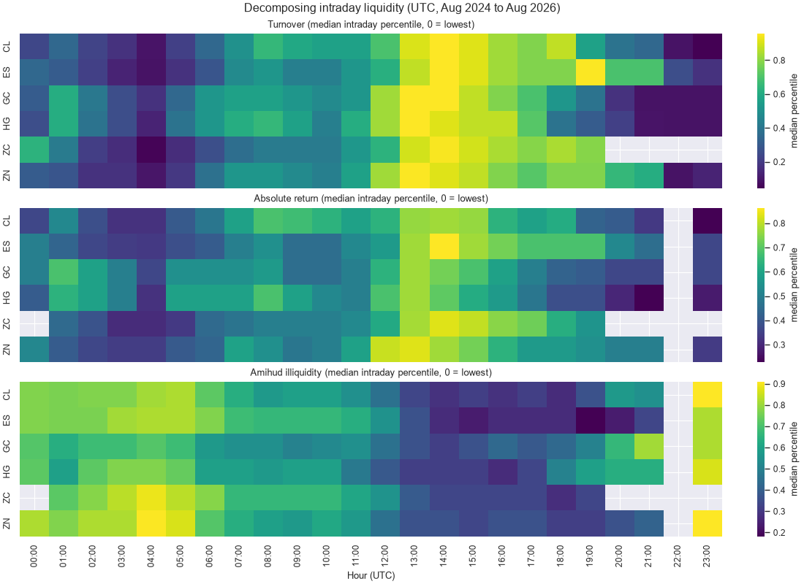
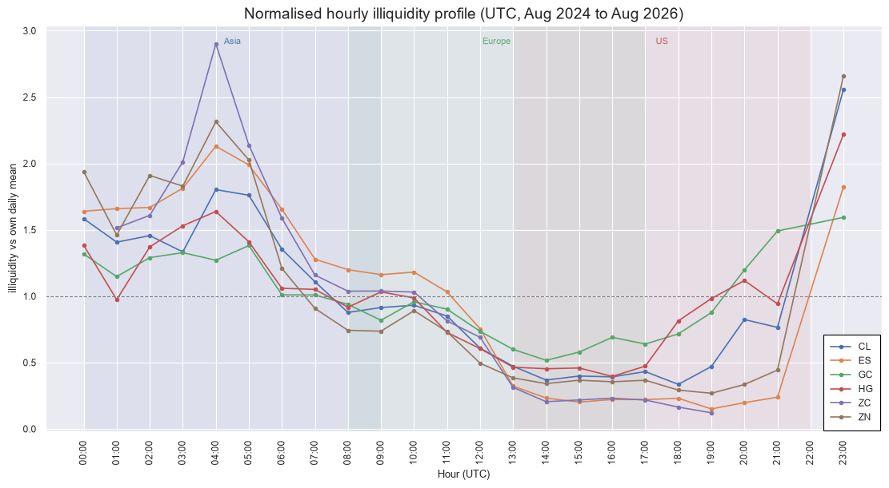

# CME Futures: Intraday Liquidity & Execution Timing Analysis
 
## Notebook
 
The full analysis and visualisations are available in the notebook below:
 
- [Full Project Notebook](notebooks/analysis.ipynb)
## Background
 
- Many systematic strategies rebalance once a day, updating the signal on the daily bar and executing the resulting trade shortly afterwards.
- The signal holds for the remainder of the day, so the hour at which execution takes place is relatively a 'free choice' rather than a constraint imposed by the strategy.
- This project evaluates which hours are cheapest to execute in across six CME futures contracts, using Amihud illiquidity as a proxy for the cost of trading.
## Overview
 
- Turnover analysis identifies when market participants are most active across the trading day.
- Absolute return analysis identifies when price moves most, which does not coincide with when volume arrives.
- Amihud illiquidity combines the two into price movement per unit of flow, isolating the hours that are genuinely expensive to trade in.
- Sub-period analysis tests whether the resulting ranking is stable or an artefact of the sample window.
### Intraday Liquidity Decomposition
 

 
 
## Measurement Framework
 
### Absolute Return
 
The absolute log return over the hour, measured from consecutive closes, standing in for how far price moved.
 
$$
r_t = \left| \ln \frac{P_t}{P_{t-1}} \right|
$$
 
### Amihud Illiquidity
 
Amihud illiquidity measures how far price moves per unit of volume traded.
 
$$
A_t = \frac{r_t}{V_t}
$$
 
### Intraday Percentile Rank
 
Each hour is ranked within its own instrument-day and the median percentile is taken across days, since raw Amihud differs by orders of magnitude between contracts.
 
$$
\bar{r}_h = \text{median}_d \left( \text{pctrank}_d (A_{h,d}) \right)
$$
 
 
## Results
 
- The cheapest execution window is 13:00 to 20:00 UTC across all six contracts.
- The most expensive window is 23:00 to 05:00 UTC, covering the reopen after the CME maintenance break and the hours before the Asian session becomes active.
- Midnight UTC, a natural default for anything working in UTC, falls inside the expensive block for every contract in the sample.
- The ratio between the worst hour and the best ranges from 3.1 for gold to 23.9 for corn, an eightfold spread despite all six trading on the same exchange under the same maintenance break.
- The ranking is identical across both halves of the sample, which indicates the concentration of a contract's liquidity is a stable characteristic rather than a feature of the period.

| Contract | Cheapest hours (UTC) | Dearest hours (UTC) | Worst / best |
|:---:|:---:|:---:|:---:|
| Corn (ZC) | 19:00, 18:00, 14:00 | 04:00, 05:00, 03:00 | 23.9 |
| E-mini S&P 500 (ES) | 19:00, 20:00, 15:00 | 04:00, 05:00, 23:00 | 14.1 |
| 10-Year T-Note (ZN) | 19:00, 18:00, 20:00 | 23:00, 04:00, 05:00 | 9.9 |
| WTI Crude (CL) | 18:00, 14:00, 16:00 | 23:00, 04:00, 05:00 | 7.6 |
| Copper (HG) | 16:00, 14:00, 15:00 | 23:00, 04:00, 03:00 | 5.6 |
| Gold (GC) | 14:00, 15:00, 13:00 | 23:00, 21:00, 05:00 | 3.1 |

### Normalised Profile Comparison
 

 
 
## Methodology
 
- Hourly bars are loaded per contract and combined into a single long frame keyed on instrument and timestamp.
- Dates flagged by the data provider as reduced quality are removed, followed by the calendar day on which each contract rolls.
- Holidays and early closes are removed using each product's own Globex calendar, so grains are handled separately from equities, rates, energy and metals.
- Returns are only measured between bars exactly one hour apart, so a return spanning the maintenance break or a removed day is set to missing rather than measured across the gap.
- Instrument-hours with fewer than 150 observations are excluded from all estimates.
## Key Takeaways
 
- Liquidity is not evenly distributed through the trading day and the penalty for executing at the wrong hour is material.
- The worst hours are not simply the quietest ones, they are the hours where volume has fallen away but price movement has not fallen with it.
- All six contracts agree on when the good execution window sits and differ only on how much the choice of hour matters.
- Holding the exchange constant removes venue calendar effects, so the remaining variation is attributable to the contract itself.
- A daily strategy executing at the bar boundary is trading in the most expensive window by default rather than by choice.
## Data
 
### Source
 
- Hourly OHLCV bars sourced from Databento, dataset GLBX.MDP3.
- Volume-based continuous front-month contracts, resolved by highest traded volume rather than nearest expiry.
### Contracts
 
- E-mini S&P 500 (ES), 10-Year T-Note (ZN), WTI Crude (CL), Gold (GC), Copper (HG) and Corn (ZC).
- All six listed on CME, spanning five asset classes.
### Sample Period
 
- August 2024 to August 2026, approximately 68,000 raw bars.
## Project Structure
 
```text
├── data/
│   ├── processed/
│   │   └── bars.parquet
│   └── raw/
│       ├── CL_1h.csv
│       ├── ES_1h.csv
│       ├── GC_1h.csv
│       ├── HG_1h.csv
│       ├── ZC_1h.csv
│       └── ZN_1h.csv
├── figures/
│   ├── amihud_heatmap.png
│   ├── normalised_profile.png
│   ├── profile_by_contract.png
│   ├── summary.png
│   ├── turnover_heatmap.png
│   └── absolute_return_heatmap.png
├── notebooks/
│   └── analysis.ipynb
├── scripts/
│   └── run_clean.py
├── src/
│   ├── aggregate.py
│   ├── clean.py
│   └── plots.py
├── requirements.txt
└── README.md
```
 
## Tools
 
- Pandas for data manipulation and preprocessing.
- NumPy for numerical calculations.
- Matplotlib and seaborn for visualisation.
- pandas_market_calendars for exchange session handling.
- Databento for historical futures market data.
## Usage
 
Install dependencies:
 
```text
pip install -r requirements.txt
```
 
Run the cleaning pipeline:
 
```text
python scripts/run_clean.py
```
 
Open the notebook and run all cells:
 
```text
notebooks/analysis.ipynb
```
 
This reproduces:
 
- Sample coverage diagnostics.
- Turnover, absolute return and Amihud illiquidity heatmaps.
- Illiquidity profiles by contract.
- Normalised profile comparison.
- Execution timing cost summary and sub-period stability check.
## Limitations
 
- Amihud ranks hours rather than pricing them, so the analysis cannot state what the difference costs in basis points. Quote or order book data would be required.
- The numerator is a single absolute return rather than a volatility estimate, following Amihud's original definition, so the hourly figure is noisy and the analysis relies on medians across roughly 480 days.
- All measurement is in UTC while CME anchors its sessions to Chicago, and the two shift clocks on different dates, so every session boundary is smeared across two UTC hours.
- All six contracts sit on one exchange, which makes the comparison clean but means each carries a US operational rhythm.
- Deferring execution is not free, since trading later in the day means acting on a staler signal. Measuring that trade-off would require a strategy attached.
## Sources
 
- Databento CME Globex MDP 3.0 dataset: https://databento.com/datasets/GLBX.MDP3
- CME Group agricultural futures trading hours: https://www.cmegroup.com/markets/agriculture.html
- Amihud, Y. (2002), Illiquidity and stock returns: cross-section and time-series effects, Journal of Financial Markets.